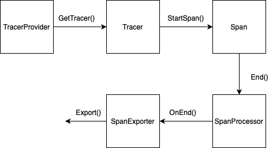
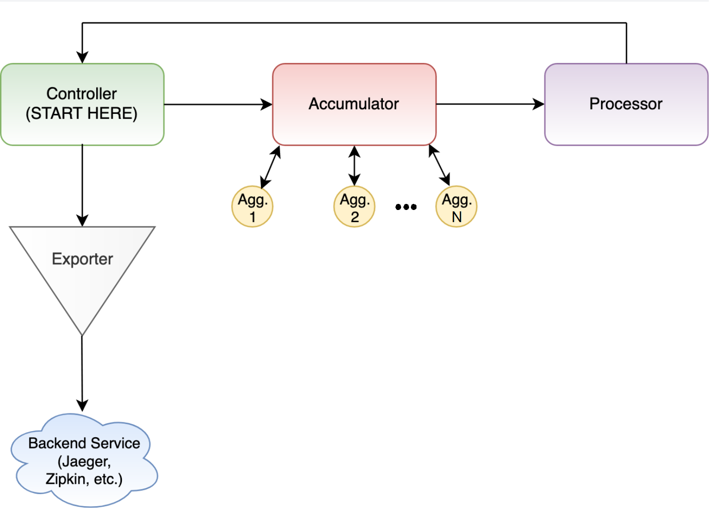

# OStreamExporter Design

In strongly typed languages typically there will be 2 separate `Exporter`
interfaces, one that accepts spans from a tracer (SpanExporter) and one that
accepts metrics (MetricsExporter)

The exporter SHOULD be called with a checkpoint of finished (possibly
dimensionally reduced) export records. Most configuration decisions have been
made before the exporter is invoked, including which instruments are enabled,
which concrete aggregator types to use, and which dimensions to aggregate by.

## Use Cases

Monitoring and alerting systems commonly use the data provided through metric
events or tracers, after applying various aggregations and converting into
various exposition format. After getting the data, the systems need to be able
to see the data. The OStreamExporter will be used here to print data through an
ostream, this is seen as a simple exporter where the user doesn’t have the
burden of implementing or setting up a protocol dependent exporter.

The OStreamExporter will also be used as a debugging tool for the Metrics
API/SDK and Tracing API/SDK which are currently work in progress projects. This
exporter will allow contributors to easily diagnose problems when working on the
project.

## Push vs Pull Exporter

There are two different versions of exporters: Push and Pull. A Push Exporter
pushes the data outwards towards a system, in the case of the OStreamExporter it
sends its data into an ostream. A Pull Exporter exposes data to some endpoint
for another system to grab the data.

The OStreamExporter will only be implementing a Push Exporter framework.

## Design Tenets

* Reliability
  * The Exporter should be reliable; data exported should always be accounted
    for. The data will either all be successfully exported to the destination
    server, or in the case of failure, the data is dropped. `Export` will always
    return failure or success to notify the user of the result.
  * Thread Safety
    * The OStreamExporter can be called simultaneously, however we do not handle
      this in the Exporter. Synchronization should be done at a lower level.
* Scalability
  * The Exporter must be able to operate on sizeable systems with predictable
    overhead growth.  A key requirement of this is that the library does not
    consume unbounded memory resource.
* Security
  * OStreamExporter should only be used for development and testing purpose,
    where security and privacy is less a concern as it doesn't communicate to
    external systems.

## SpanExporter

`Span Exporter` defines the interface that protocol-specific exporters must
implement so that they can be plugged into OpenTelemetry SDK and support sending
of telemetry data.

The goal of the interface is to minimize burden of implementation for
protocol-dependent telemetry exporters. The protocol exporter is expected to be
primarily a simple telemetry data encoder and transmitter.

The SpanExporter is called through the SpanProcessor, which passes finished
spans to the configured SpanExporter, as soon as they are finished. The
SpanProcessor also shutdown the exporter by the Shutdown function within the
SpanProcessor.

<!-- [//]: #  -->

The specification states: exporter must support two functions: Export and
Shutdown.

### SpanExporter.Export(span of recordables)

Exports a batch of telemetry data. Protocol exporters that will implement this
function are typically expected to serialize and transmit the data to the
destination.

Export() must not block indefinitely. We can rely on printing to an ostream is
reasonably performant and doesn't block.

The specification states: Any retry logic that is required by the exporter is
the responsibility of the exporter. The default SDK SHOULD NOT implement retry
logic, as the required logic is likely to depend heavily on the specific
protocol and backend the spans are being sent to.

### SpanExporter.Shutdown()

Shuts down the exporter. Called when SDK is shut down. This is an opportunity
for exporter to do any cleanup required.

`Shutdown` should be called only once for each `Exporter` instance. After the
call to `Shutdown` subsequent calls to `Export` are not allowed and should
return a `Failure` result.

`Shutdown` should not block indefinitely (e.g. if it attempts to flush the data
and the destination is unavailable). Language library authors can decide if they
want to make the shutdown timeout configurable.

In the OStreamExporter there is no cleanup to be done, so there is no need to
use the timeout within the `Shutdown` function as it will never be blocking.

```cpp
class StreamSpanExporter final : public sdktrace::SpanExporter
{

private:
    bool isShutdown = false;

public:
    /*
        This function should never be called concurrently.
    */
    sdktrace::ExportResult Export(
        const nostd::span<std::unique_ptr<sdktrace::Recordable>> &spans) noexcept
    {

        if(isShutdown)
        {
            return sdktrace::ExportResult::kFailure;
        }

        for (auto &recordable : spans)
        {
            auto span = std::unique_ptr<sdktrace::SpanData>(
                static_cast<sdktrace::SpanData *>(recordable.release()));

            if (span != nullptr)
            {
                char trace_id[32]       = {0};
                char span_id[16]        = {0};
                char parent_span_id[16] = {0};

                span->GetTraceId().ToLowerBase16(trace_id);
                span->GetSpanId().ToLowerBase16(span_id);
                span->GetParentSpanId().ToLowerBase16(parent_span_id);

                std::cout << "{"
                          << "\n  name          : " << span->GetName()
                          << "\n  trace_id      : " << std::string(trace_id, 32)
                          << "\n  span_id       : " << std::string(span_id, 16)
                          << "\n  parent_span_id: " << std::string(parent_span_id, 16)
                          << "\n  start         : " << span->GetStartTime().time_since_epoch().count()
                          << "\n  duration      : " << span->GetDuration().count()
                          << "\n  description   : " << span->GetDescription()
                          << "\n  status        : " << span->GetStatus()
                          << "\n  attributes    : " << span->GetAttributes() << "\n}"
                          << "\n";
            }

        }

        return sdktrace::ExportResult::kSuccess;
    }

    bool Shutdown(std::chrono::microseconds timeout = (std::chrono::microseconds::max)()) noexcept
    {
        isShutdown = true;
        return true;
    }
};
```

## MetricsExporter

The MetricsExporter has the same requirements as the SpanExporter. The exporter
will go through the different metric instruments and send the value stored in
their aggregators to an ostream, for simplicity only Counter is shown here, but
all aggregators will be implemented. Counter, Gauge, MinMaxSumCount, Sketch,
Histogram and Exact Aggregators will be supported.

Exports a batch of telemetry data. Protocol exporters that will implement this
function are typically expected to serialize and transmit the data to the
destination.

<!-- [//]: #  -->

### MetricsExporter.Export(batch of Records)

Export() must not block indefinitely. We can rely on printing to an ostream is
reasonably performant and doesn't block.

The specification states: Any retry logic that is required by the exporter is
the responsibility of the exporter. The default SDK SHOULD NOT implement retry
logic, as the required logic is likely to depend heavily on the specific
protocol and backend the spans are being sent to.

The MetricsExporter is called through the Controller in the SDK data path. The
exporter will either be called on a regular interval in the case of a push
controller or through manual calls in the case of a pull controller.

### MetricsExporter.Shutdown()

Shutdown() is currently not required for the OStreamMetricsExporter.

```cpp
class StreamMetricsExporter final : public sdkmeter::MetricsExporter
{

private:
    bool isShutdown = false;

public:
    sdkmeter::ExportResult Export(
        const Collection<Record> batch) noexcept
    {

        for (auto &metric : batch)
        {

            if (metric != nullptr)
            {

                if(metric.AggregationType == CounterAggregator) {
                    std::cout << "{"
                              << "\n  name          : " << metric->GetName()
                              << "\n  labels        : " << metric->GetLabels()
                              << "\n  sum           : " << metric->Value[0] << "\n}"
                }
                else if(metric.AggregationType == SketchAggregator) {
                    // Similarly print data
                }
                // Other Aggreagators will also be handeled,
                // Counter, Gauge, MinMaxSumCount, Sketch, Histogram,
                // and Exact Aggreagtors
            }

        }

        return sdkmeter::ExportResult::kSuccess;
    }

};
```

## Test Strategy / Plan

In this project, we will follow the TDD rules, and write enough functional unit
tests before implementing production code. We will design exhaustive test cases
for normal and abnormal inputs, and tests for edge cases.

In terms of test framework, as is described in the [Metrics API/SDK design
document](https://quip-amazon.com/UBXyAuqRzkIj/Metrics-APISDK-C-Design-Document-External),
the OStreamExporter will use [Googletest](https://github.com/google/googletest)
framework because it provides test coverage reports, and it also integrate code
coverage tools such as [codecov.io](http://codecov.io/) in the project. There
are already many reference tests such as MockExporter tests written in
GoogleTest, making it a clear choice to stick with it as the testing framework.
A required coverage target of 90% will help to ensure that our code is fully
tested.

## Future Features

* Serialize data to another format (json)

## Contributors

* Hudson Humphries
