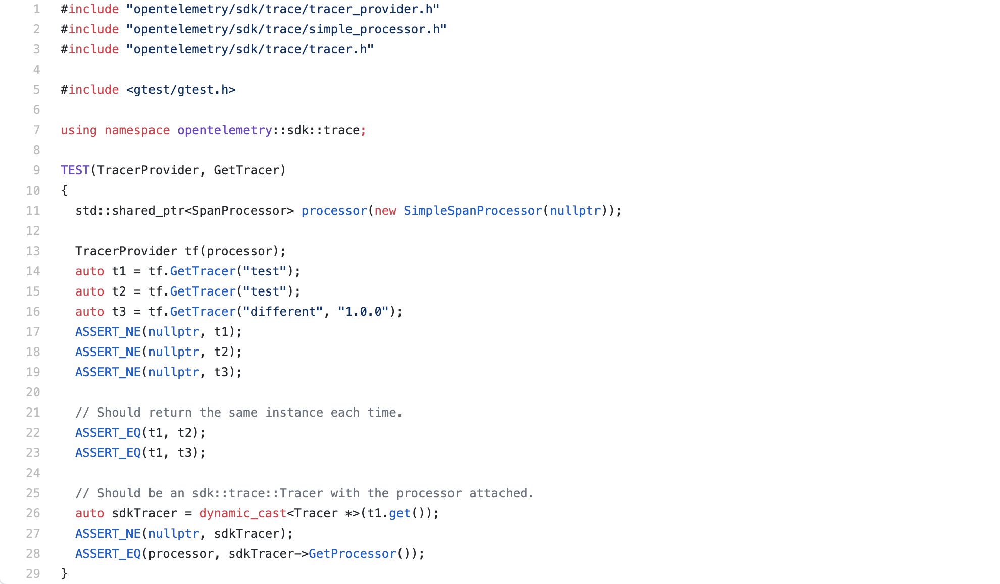
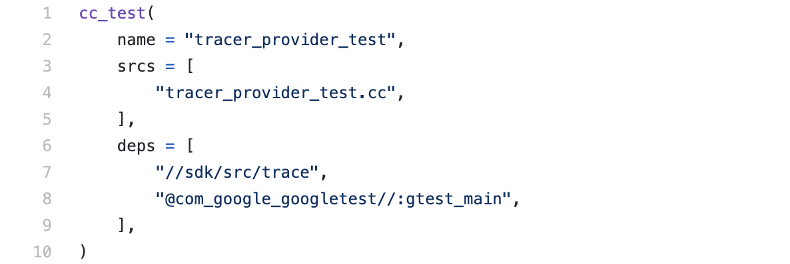
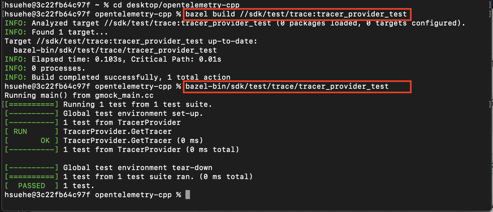
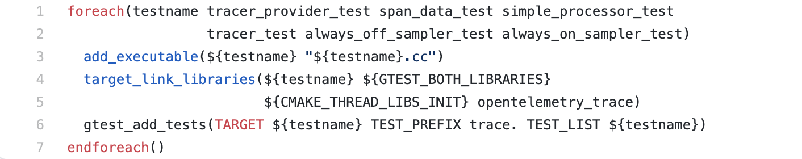
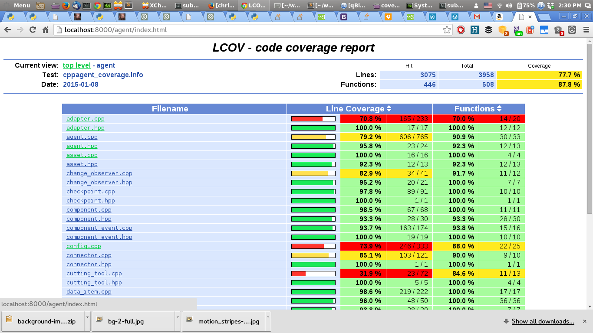
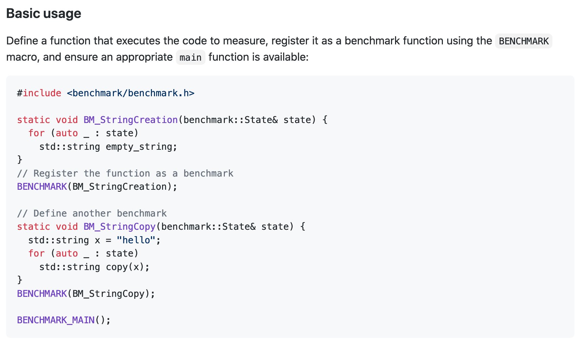
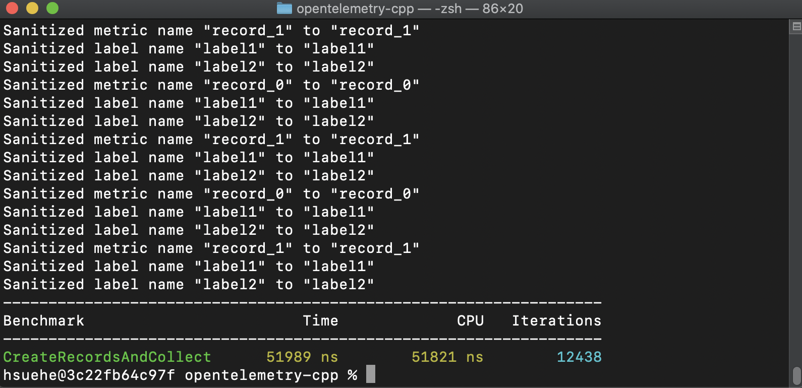

# Google Test Demo

## Introduction

[Google Test](https://github.com/google/googletest) is a unit testing framework for C++ programming developed by Google. It is currently being used for unit testing in the [Open Telemetry CPP](https://github.com/open-telemetry/opentelemetry-cpp) repo, along with tools like [codecov.io](http://codecov.io/) to thoroughly test the code in the repository. A primer for using Google Test can be found [here](https://github.com/google/googletest/blob/master/googletest/docs/primer.md).

## Features

Google Test provides a vast set of tools to be used for unit testing. The two most important are assertions and tests. 

### Assertions

Google Test allows a developer to write test cases that use assertions to verify code behavior. An assertion can result in either a success, nonfatal failure, or fatal failure. A success occurs when the assertion holds true. A nonfatal failure does not abort the current function when an assertion fails, and a fatal failure does. 

Assertions using the syntax `ASSERT_*`  will generate a fatal failure when they fail, and assertions using the syntax `EXPECT_*` will generate a nonfatal failure when they fail. These two types of assertions come in pairs; for example, `ASSERT_TRUE` and `ASSERT_EQ` have a corresponding `EXPECT_TRUE` and `EXPECT_EQ` to match. Refer to the [primer](https://github.com/google/googletest/blob/master/googletest/docs/primer.md) for more details on `ASSERT_*` and  `EXPECT_*` statements.

### Tests

To create a test, use the `TEST()` macro to define a test function. This is similar to a normal C++ function that returns no value. Googletest assertions are used inside the test function, and the result of the test is determined by the assertions used inside the test function. If any assertion fails (can be either fatal or nonfatal), then the test fails; if all assertions pass, the test succeeds. A sample test function is outlined below.

```C++
TEST(TestSuiteName, TestName) {

    // Test body goes here

}
```

A [sample unit test](https://github.com/open-telemetry/opentelemetry-cpp/blob/master/sdk/test/trace/tracer_provider_test.cc) from the OTel CPP repo, testing the `GetTracer()` method in the `TracerProvider` class, is shown below.



### Test Coverage Reports

Another feature that Google Test provides is test coverage reports; along with this, Google Test also allows us to easily integrate code coverage tools such as [codecov.io](http://codecov.io/) with the project. 

## Integration and Usage

One of the base requirements to build and use Google Test from a source package are to use either Bazel or CMake; the other is a C++11-standard-compliant compiler like GCC or Clang. 

### Bazel

First, to install bazel, refer to the instructions [here](https://docs.bazel.build/versions/3.3.0/install.html), and for an example build using bazel, refer to the tutorial [here](https://docs.bazel.build/versions/3.3.0/tutorial/cpp.html).

Bazel makes use of a `BUILD` file, which gives instructions to bazel on how to build the project. The file contains targets that point to a set of source files and dependencies. Along with a `BUILD` file, a `WORKSPACE` file exists that identifies the directory it resides in as a bazel workspace. In the OTel CPP repository, the SDK unit tests using the Google Test framework to ensure code functionality. In the [BUILD](https://github.com/open-telemetry/opentelemetry-cpp/tree/master/sdk/test/trace) file for trace tests, there are six different targets, each corresponding to a different unit test. An example target taken from this file is shown below.



Integrating Google Tests with bazel is as simple as creating a target with:
- name: The target name, aka the name of the binary to build
- srcs: The source file containing the tests
- deps: The dependencies of the build; here, `//sdk/src/trace` refers to the directory of the source code being tested, and `@com_google_googletest//:gtest_main` is the Google Test dependency. 


Building and executing a unit test is also very simple. 



On terminal, navigate to the directory the WORKSPACE file resides in, and execute two commands:

```C++
bazel build //path/to/package:target-name
bazel-bin/path/to/package/target-name
```
The first command builds the unit test with the given target name; the second runs the unit test.

This next command runs the above two commands at once, though you may get a message stating `There were tests whose specified size is too big` and they may not run without modifying some options.

```C++
bazel test //path/to/package:target-name
```

In the diagram shown, `bazel build //path/to/package:target-name` is `bazel build //sdk/test/trace:tracer_provider_test`, and `bazel-bin/path/to/package/target-name` is `bazel-bin/sdk/test/trace/tracer_provider_test`. The test builds successfully, and 1 out of 1 tests pass.

Additionally, all Bazel tests can be ran in a Docker container by navigating to the root of the directory and executing the command:
```
./ci/run_docker.sh ./ci/do_ci.sh bazel.test
```

### CMake

CMake can be installed following instructions from [here](https://cmake.org/download/). You will also need to install Google Test, along with libbenchmark.

Download a zip of the Google Test source code [here](https://github.com/google/googletest/releases/tag/release-1.10.0). Then, navigate into the source code directory and run the following commands:

```C++
mkdir build && cd build
cmake ..
make
make install
```

This will install Google Test for you; you can delete the source code after running these commands.

Next, follow the instructions [here](https://github.com/google/benchmark#installation) to download Google Benchmark. The section following this one will detail performance benchmarking using Google Benchmark.


CMake makes use of a `CMakeLists.txt` file that provides instructions for a project’s source files and targets. There is a main `CMakeLists.txt` file in the root of the project directory, and a `CMakeLists.txt` for each subdirectory. In the main `CMakeLists.txt` file, the `cmake_minimum_required`  and `CMAKE_CXX_STANDARD` are set, the project name is set with `project()`, directories are included and subdirectories added, and much more. However, more importantly, in the context of Google Test within the OTel CPP repo, the `CMakeLists.txt` to look at is the one located in the directory your tests are being written in; for this example, it’s `opentelemetry-cpp/sdk/test/trace`. This [CMakeLists.txt](https://github.com/open-telemetry/opentelemetry-cpp/blob/master/sdk/test/trace/CMakeLists.txt) file, shown below, describes the names of the tests to be added as executables.



This is how a `CMakeLists.txt` file will be written with the purpose of unit testing. After writing a unit test, navigate to the `CMakeLists.txt` file for that subdirectory and add the test name to the list of test names in `foreach()`.


To build and execute using CMake, navigate into the root directory (`opentelemetry-cpp` here), and run the following commands from terminal:

```C++
mkdir build && cd build
cmake .. // or cmake -DCMAKE_BUILD_TYPE=Debug -DCMAKE_CXX_FLAGS=“-Werror —coverage” ..
make
make test
```
This will run all tests in the repo.

To run tests individually, in terminal, navigate to the `build` directory and execute the following command:
```
ctest -R <name_of_your_test>
```
For example, this command will build and execute the test named TEST(Meter, CollectSyncInstruments) in the metrics library:
```
ctest -R metrics.Meter.CollectSyncInstruments
```

The second cmake option creates test coverage reports; these are able to be viewed using a tool like lcov (instructions to download [here](http://ltp.sourceforge.net/coverage/lcov.php)), and running the command
```C++
lcov --directory $PWD --capture --output-file coverage.info
```

Below is a sample coverage.info file generated from lcov:




Additionally, all CMake tests can be ran in a Docker container by navigating to the root of the directory and executing the command:
```
./ci/run_docker.sh ./ci/do_ci.sh cmake.test
```

### Performance Benchmarking

While Google Test itself does not provide performance benchmarking, Google Benchmark, a closely related tool, does. Follow the instructions [here](https://github.com/google/benchmark#installation) to download Google Benchmark using CMake. A basic usage example can be viewed [here](https://github.com/google/benchmark#usage), while a more in depth usage guide can be found [here](https://github.com/google/benchmark#user-guide). Below is a snippet from the basic usage example that outlines the structure of a benchmarked routine. Generally, it is very similar to the Googletest unit testing structure and we can easily convert unit tests into benchmarked routines.



A benchmark consists of a “benchmarked function” which takes a benchmark state as a parameter.  The library automatically decides how many iterations to run based on the duration of the first few run iterations.  This function is called directly underneath using the benchmark macro.  Finally, a call to BENCHMARK_MAIN() runs all benchmarks.  As a proof of concept, below is a unit test for the PrometheusCollector class into a benchmark:
```C++
#include "opentelemetry/exporters/prometheus/prometheus_collector.h"
#include "opentelemetry/sdk/metrics/aggregator/counter_aggregator.h"
#include "opentelemetry/sdk/metrics/record.h"
#include "opentelemetry/version.h"
#include <benchmark/benchmark.h>

OPENTELEMETRY_BEGIN_NAMESPACE
namespace exporters
{
namespace prometheus
{

void CreateRecordsAndCollect(benchmark::State &state) {


    for (auto _ : state) {

        // construct a collection to add metric records
        int num_records = 2;
        std::vector<opentelemetry::sdk::metrics::Record> records;

        for (int i = 0; i < num_records; i++)
        {
            std::string name        = "record_" + std::to_string(i);
            std::string description = "record_" + std::to_string(i);
            std::string labels      = "{label1:v1,label2:v2,}";
            auto aggregator         = std::shared_ptr<opentelemetry::sdk::metrics::Aggregator<int>>(
                new opentelemetry::sdk::metrics::CounterAggregator<int>(
                    opentelemetry::metrics::InstrumentKind::Counter));
            aggregator->update(10);
            aggregator->checkpoint();

            opentelemetry::sdk::metrics::Record r{name, description, labels, aggregator};
            records.push_back(r);
        }
        
        opentelemetry::exporter::prometheus::PrometheusCollector collector;

        collector.AddMetricData(records);

        collector.Collect();
        
    }
}
BENCHMARK(CreateRecordsAndCollect);

} //namespace prometheus
} //namespace exporters
OPENTELEMETRY_END_NAMESPACE

BENCHMARK_MAIN();
```

Output


OTel provides a bazel shortcut to build tests which can be seen [here](https://github.com/open-telemetry/opentelemetry-cpp/blob/573696f3fdc1fd85e24ac19860ae6f2345837a3e/bazel/otel_cc_benchmark.bzl). This not only creates a benchmark executable, but a “smoketest” which runs each benchmark for one iteration.

We can use benchmarking to measure performance of exporting, data translation, and collecting. Additionally, creating benchmarks for each component will help us determine which areas of the pipeline can be optimized further. 
