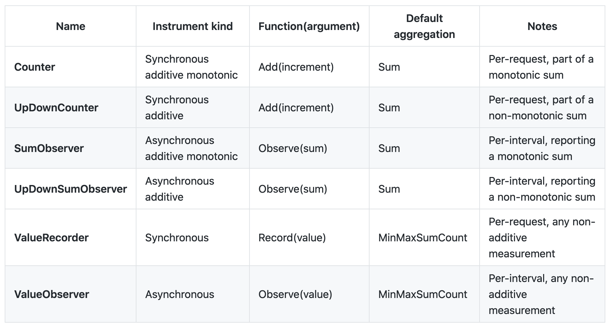

# Metrics API Design

This document outlines a proposed implementation of the OpenTelemetry Metrics API in C++.  The design conforms to the current versions of the [Metrics API Specification](https://github.com/open-telemetry/opentelemetry-specification/blob/master/specification/metrics/api.md) though it is currently under development and subject to change.

This design supports a minimal implementation for the library to be used by an application. However, without the SDK or another implementation no metric data will be collected.

## Use Cases

A *metric* is some raw measurement about a service, captured at run-time. Logically, the moment of capturing one of these measurements is known as a *metric event* which consists not only of the measurement itself, but the time that it was captured as well as contextual annotations which tie it to the event being measured. Users can inject instruments which facilitate the collection of these measurements into their services or systems which may be running locally, in containers, or on distributed platforms.  The data collected are then used by monitoring and alerting systems to provide statistical performance data.

Monitoring and alerting systems commonly use the data provided through metric events, after applying various aggregations and converting into various exposition formats. However, we find that there are many other uses for metric events, such as to record aggregated or raw measurements in tracing and logging systems. For this reason, OpenTelemetry requires a separation of the API from the SDK, so that different SDKs can be configured at run time.

Various instruments also allow for more optimized capture of certain types of measurements.  `Counter` instruments, for example, are monotonic and can therefore be used to capture rate information.  Other potential uses for the `Counter` include tracking the number of bytes received, requests completed, accounts created, etc. 

A `ValueRecorder` is commonly used to capture latency measurements. Latency measurements are not additive in the sense that there is little need to know the latency-sum of all processed requests. We use a `ValueRecorder` instrument to capture latency measurements typically because we are interested in knowing mean, median, and other summary statistics about individual events.

`Observers` are a good choice in situations where a measurement is expensive to compute, such that it would be wasteful to compute on every request. For example, a system call is needed to capture process CPU usage, therefore it should be done periodically, not on each request.


## Design Tenets

* Reliability
    * The Metrics API and SDK should be “reliable,” meaning that metrics data will always be accounted for. It will get back to the user or an error will be logged.  Reliability also entails that the end-user application will never be blocked.  Error handling will therefore not interfere with the execution of the instrumented program.  
    * Thread Safety 
        * As with the Tracer API and SDK, thread safety is not guaranteed on all functions and will be explicitly mentioned in documentation for functions that support concurrent calling.  Generally, the goal is to lock functions which change the state of library objects (incrementing the value of a Counter or adding a new Observer for example) or access global memory.  As a performance consideration, the library strives to hold locks for as short a duration as possible to avoid lock contention concerns.  Calls to create instrumentation may not be thread-safe as this is expected to occur during initialization of the program.  
* Scalability
    * As OpenTelemetry is a distributed tracing system, it must be able to operate on sizeable systems with predictable overhead growth.  A key requirement of this is that the library does not consume unbounded memory resource. 
* Security
    * Currently security is not a key consideration but may be addressed at a later date.

## **Meter Interface (`MeterProvider` Class)**

The singleton global `MeterProvider` can be used to obtain a global Meter by calling `global.GetMeter(name,version)` which calls `GetMeter() `on the initialized global `MeterProvider`

**Global Meter Provider**

The API should support a global `MeterProvider`.  When a global instance is supported, the API must ensure that `Meter` instances derived from the global `MeterProvider` are initialized after the global SDK implementation is first initialized.

A `MeterProvider` interface must support a  `global.SetMeterProvider(MeterProvider)` function which installs the SDK implementation of the `MeterProvider` into the API

**Obtaining a Meter from MeterProvider**

**`GetMeter(name, version)` method must be supported**

* Expects 2 string arguments:
    * name (required): identifies the instrumentation library. 
    * version (optional): specifies the version of the instrumenting library (the library injecting OpenTelemetry calls into the code)

```
# meter_provider.h

class Provider
{
public:
  /*
   * Get Meter Provider
   *
   * Returns the singleton MeterProvider. By default, a no-op MeterProvider 
   * is returned. This will never return a nullptr MeterProvider.
   *
   */
  static nostd::shared_ptr<MeterProvider> GetMeterProvider();
  {
    GetProvider();
  }

  /*
   * Set Meter Provider
   *
   * Changes the singleton MeterProvider.
   *
   * Arguments:
   * newMeterProvider, the MeterProvider instance to be set as the new global 
   *                   provider.
   */
  static void SetMeterProvider(nostd::shared_ptr<MeterProvider> newMeterProvider);

private:
  /*
   * Get Provider
   *
   * Returns a no-op MeterProvider.
   *
   */
  static nostd::shared_ptr<MeterProvider> &GetProvider() noexcept
  {
    return DefaultMeterProvider();
  }
};
```

```
# meter_provider.h

class MeterProvider
{
public:
  /*
   * Get Meter
   *
   * Gets or creates a named meter instance.
   *
   * Arguments:
   * library_name, the name of the instrumenting library.
   * library_version, the version of the instrumenting library (OPTIONAL).
   */
  nostd::shared_ptr<Meter> GetMeter(nostd::string_view library_name,
                                    nostd::string_view library_version = "")
};
```

Using this MeterProvider, users can obtain new Meters through the GetMeter function.

## **Metric Instruments (`Meter` Class)**

**Metric Events**

This interface consists of a set of **instrument constructors**, and a **facility for capturing batches of measurements.**


```
# meter.h

Class Meter {
public:
  
/////////////////////////Metric Instrument Constructors////////////////////////////  
  
 /*
  * New Double Counter
  *
  * Function that creates and returns a Counter metric instrument with value
  * type double.
  *
  * Arguments:
  * name, the name of the metric instrument (must conform to the above syntax).
  * description, a brief, readable description of the metric instrument.
  * unit, the unit of metric values following the UCUM convention
  *       (https://unitsofmeasure.org/ucum.html).
  * enabled, a boolean that turns on or off collection.
  *
  */ 
  virtual nostd::shared_ptr<DoubleCounter> 
                            NewDoubleCounter(nostd::string_view name, 
                            nostd::string_view description,
                            nostd::string_view unit, 
                            nostd::string_view enabled);
  
 /*
  * New int Counter
  *
  * Function that creates and returns a Counter metric instrument with value
  * type int.
  *
  * Arguments:
  * name, the name of the metric instrument (must conform to the above syntax).
  * description, a brief, readable description of the metric instrument.
  * unit, the unit of metric values following the UCUM convention
  *       (https://unitsofmeasure.org/ucum.html).
  * enabled, a boolean that turns on or off collection.
  *
  */ 
  virtual nostd::shared_ptr<LongCounter> NewIntCounter(nostd::string_view name,
                                                       nostd::string_view description,
                                                       nostd::string_view unit,
                                                       nostd::string_view enabled);
  
////////////////////////////////////////////////////////////////////////////////////
//                                                                                //
//                     Repeat above two functions for all                         //
//                     six (five other) metric instruments.                       //
//                                                                                //
////////////////////////////////////////////////////////////////////////////////////
  
 /*
  * RecordBatch
  *
  * Allows the functionality of acting upon multiple metrics with the same set 
  * of labels with a single API call. Implementations should find bound metric 
  * instruments that match the key-value pairs in the labels.
  *
  * Arugments:
  * labels, labels associated with all measurements in the batch.
  * values, a KeyValueIterable where the key is a string containing the name
  *         of metric instruments such as "IntCounter" or "DoubleUpDownSumObserver"
  *         and the value is the value to be recorded to all metric instruments in 
  *         the batch of the associated instrument type.
  *
  */ 
  virtual void RecordBatch(nostd::KeyValueIterable labels, 
                           nostd::span<pair(SynchronousInstrument, variant<int, double>), values) noexcept;
private:
  MeterProvider meterProvider_;
  InstrumentationInfo instrumentationInfo_;
}
```

### **Meter API Class Design Considerations**

According to the specification, both signed integer and floating point value types must be supported.  This implementation will use int64 and double types. Though int64 is more memory intensive than a standard int32, logs can easily measure quantities exceeding 2 billion. Different constructors are used for the different metric instruments and even for different value types due to C++ being a strongly typed language. This is identical to Java’s implementation of the meter class. Python gets around this by passing the value type and metric type to a single function called `create_metric`. A C++ implementation in this way would require the use of templates which would greatly increase the complexity of the code while offering only small benefits to users.

## **Instrument Types (`Metric` Class)**

Metric instruments capture raw measurements of designated quantities in instrumented applications.  All measurements captured by the Metrics API are associated with the instrument which collected that measurement.  

### Metric Instrument Data Model

Each instrument must have enough information to meaningfully attach its measured values with a process in the instrumented application.  As such, metric instruments contain the following information:

* name (string) — Identifier for this metric instrument.
* description (string) — Short description of what this instrument is capturing.
* value_type (string or enum) — Determines whether the value tracked is an int64 or double.
* meter (Meter) — The Meter instance from which this instrument was derived.
* label_keys (KeyValueIterable) — A nostd class acting as a map from nostd::string_view to nostd::string_view
* enabled (boolean) — Determines whether the instrument is currently collecting data.
* bound_instruments (key value container) — Contains the bound instruments derived from this instrument.


Metric instruments are created through instances of the `Meter` class and each type of instrument can be described with the following properties:

* Synchronicity:  A synchronous instrument is called by the user in a distributed [Context](https://github.com/open-telemetry/opentelemetry-specification/blob/master/specification/context/context.md) (i.e., Span context, Correlation context) and is updated once per request. An asynchronous instrument is called by the SDK once per collection interval and only one value from the interval is kept.
* Additivity:  An additive instrument is one that records additive measurements, meaning the final sum of updates is the only useful value.  Non-additive instruments should be used when the intent is to capture information about the distribution of values.
* Monotonicity: A monotonic instrument is an additive instrument, where the progression of each sum is non-decreasing. Monotonic instruments are useful for monitoring rate information.

The following instrument types will be supported:

### Metric Event Data Model

Each measurement taken by a Metric instrument is a Metric event which must contain the following information:

* timestamp (implicit) — System time when measurement was captured.
* instrument definition(strings) — Name of instrument, kind, description, and unit of measure 
* label set (key value pairs) — Labels associated with the capture, described further below.
* value (string) — Determines whether the class uses long or double values.
    * Metrics API spec: value (**signed integer** or **floating point number**).
* resources associated with the SDK at startup

**Label Set**

A key:value mapping of some kind MUST be supported as annotation each metric event.  Labels must be represented the same way throughout the API (i.e. using the same idiomatic data structure) and duplicates are dealt with by taking the last value mapping.

**To maintain ABI stability, we have chosen to implement this as a KeyValueIterable type. However, due to performance concerns, we may convert to a std::string internally.**

**Calling Conventions**

Metric instruments must support bound instrument calling where the labels for each capture remain the same.  After a call to  `instrument.Bind(labels)` , all subsequent calls to `instrument.add()` will include the labels implicitly in their capture.

Direct calling must also be supported.  The user can specify labels with the capture rather than binding beforehand by including the labels in the update call: `instrument.Add(x, labels)`.

MUST support `RecordBatch` calling (where a single set of labels is applied to several metric instruments).

```
# metric.h

/*
 * Enum classes to hold the various types of Metric Instruments and their 
 * bound complements.
 */

enum class MetricKind
{
  Counter,
  UpDownCounter,
  ValueRecorder,
  SumObserver,
  UpDownSumObserver,
  ValueObserver,
};

enum class BoundMetricKind
{
  BoundCounter,
  BoundUpDownCounter,
  BoundValueRecorder,
  BoundSumObserver,
  BoundUpDownSumObserver,
  BoundValueObserver,
};

 /*
  * Instrument
  *
  * Base class for all metric types.
  *
  * Also known as metric instrument. This is the class that is used to
  * represent a metric that is to be continuously recorded and tracked. Each
  * metric has a set of bound metrics that are created from the metric. See
  * `BoundSychnronousInstrument` for information on bound metric instruments.
  */
  
  //Do not want the getters virtual because each base class should have access to 
  //them.  Also, I removed all private variables and will add them in when writing 
  // the SDK because I have more flexibility with types and they are not necessary 
  // for a minimal noop implementation.

class Instrument {

public:

    // Note that Instruments should be created using the Meter class.
    // Please refer to meter.h for documentation.
    Instrument() = default;


    /**
     * Base class constructor for all other instrument types.  Whether or not
     * an instrument is synchronous or bound, it requires a name, description, 
     * unit, and enabled flag.
     * 
     * @param name is the identifier of the instrumenting library
     * @param description explains what the metric captures
     * @param unit specified the data type held in the instrument
     * @param enabled determins if the metric is currently capturing data
     * @return Instrument type with the specified attirbutes
     */
    Instrument(nostd::string_view name, nostd::string_view description, nostd::string_view unit, bool enabled);

    // Returns true if the instrument is enabled and collecting data
    bool IsEnabled();

    // Return the instrument name
    nostd::string_view GetName();

    // Return the instrument description
    nostd::string_view GetDescription();

    // Return the insrument's units of measurement
    nostd::string_view GetUnits();

};
```

```
class SynchronousInstrument: public Instrument {
public:
    SynchronousInstrument() = default;
    
    
    SynchronousInstrument(nostd::string_view name, nostd::string_view description, nostd::string_view unit, bool enabled);
    
    /**
    * Returns a Bound Instrument associated with the specified labels.         * Multiples requests with the same set of labels may return the same
    * Bound Instrument instance.
    *
    * It is recommended that callers keep a reference to the Bound Instrument instead of always
    * calling this method for every operation.
    *
    * @param labels the set of labels, as key-value pairs.
    * @return a Bound Instrument
   */
    BoundSynchronousInstrument bind(nostd::KeyValueIterable labels);
    /**
    * Records a single synchronous metric event. 
    * Since this is an unbound synchronous instrument, labels are required in  * metric capture calls.
    *
    *
    * @param labels the set of labels, as key-value pairs.
    * @param value the numerical representation of the metric being captured
    * @return void
   */
    void update(common::AttributeValue value, nostd::KeyValueIterable labels); //add or record
};
class BoundSynchronousInstrument: public Instrument {

public:

    BoundSynchronousInstrument() = default;

    // Will also call the processor to acquire the correct aggregator for this instrument
    BoundSynchronousInstrument(nostd::string_view name, nostd::string_view description, nostd::string_view unit, bool enabled);

    /**
    * Frees the resources associated with this Bound Instrument.
    * The Metric from which this instrument was created is not impacted.
    *
    * @param none
    * @return void
   */
    void unbind();

    /**
    * Records a single synchronous metric event.  //Call to aggregator
    * Since this is a bound synchronous instrument, labels are notrequired in  * metric capture calls.
    *
    * @param value the numerical representation of the metric being captured
    * @return void
   */
    void update(common::AttributeValue value); //add or record
};

class AsynchronousInstrument: public Instrument{

public:
    AsynchronousInstrument() = default;

    /**
     * Captures data by activating the callback function associated with the 
     * instrument and storing its return value.  Callbacks for asychronous 
     * instruments are defined during construction.
     * 
     * @param none
     * @return none
     */
    void observe();
};
```

The Counter below is an example of one Metric instrument.  It is important to note that in the Counter’s add function, it binds the labels to the instrument before calling add, then unbinds.  Therefore all interactions with the aggregator take place through bound instruments and by extension, the BaseBoundInstrument Class.

```
lass BoundIntCounter: public BoundSynchronousInstrument{ //override bind?

public:

    BoundIntCounter() = default;

    BoundIntCounter(nostd::string_view name, nostd::string_view description, nostd::string_view unit, bool enabled);

    /*
    * Add adds the value to the counter's sum. The labels are already linked   * to the instrument and are not specified. 
    * 
    * @param value the numerical representation of the metric being captured
    * @param labels the set of labels, as key-value pairs
    */
    void add(int value, nostd::KeyValueIterable labels);

    void unbind();
};

class IntCounter: public SynchronousInstrument{

public:

    IntCounter() = default;

    IntCounter(nostd::string_view name, nostd::string_view description, nostd::string_view unit, bool enabled);

    /*
    * Bind creates a bound instrument for this counter. The labels are
    * associated with values recorded via subsequent calls to Record.
    * 
    * @param labels the set of labels, as key-value pairs.
    * @return a BoundIntCounter tied to the specified labels
    */ 
    BoundIntCounter bind(nostd::KeyValueIterable labels);

    /*
    * Add adds the value to the counter's sum by sending to aggregator. The labels should contain
    * the keys and values to be associated with this value.  Counters only     * accept positive valued updates.
    * 
    * @param value the numerical representation of the metric being captured
    * @param labels the set of labels, as key-value pairs
    */
    void add(int value, nostd::KeyValueIterable labels);
};

class IntValueObserver: public AsynchronousInstrument{
public:
    /*
    * Add adds the value to the counter's sum. The labels should contain
    * the keys and values to be associated with this value.  Counters only     * accept positive valued updates.
    * 
    * @param value the numerical representation of the metric being captured
    * @param labels the set of labels, as key-value pairs
    */
    void observe(int value, std::string_view &labels) override;
private:
    // Callback function which takes a pointer to an Asynchronous instrument (this) 
    // type which is stored in an observer result type and returns nothing.  
    // The function calls the instrument's observe method.
    void (*callback)(IntObserverResult);
}
```

```
// The above Counter and BoundCounter are examples of 1 metric instrument.  
// The remaining 5 will also be implemented in a similar fashion. With Int and 
// Double for each metric instrument

class IntUpDownCounter: public SynchronousInstrument;
class DoubleUpDownCounter: public SynchronousInstrument;

class IntValueRecorder: public SynchronousInstrument;
class DoubleValueRecorder: public SynchronousInstrument;

class IntSumObserver: public AsynchronousInstrument;
class DoubleSumObserver: public AsynchronousInstrument;

class IntUpDownSumObserver: public AsynchronousInstrument;
class DoubleUpDownSumObserver: public AsynchronousInstrument;

class IntValueObserver: public AsynchronousInstrument;
class DoubleValueObserver: public AynchronousInstrument;


class BoundIntUpDownCounter: public BoundSynchronousInstrument;
class BoundDoubleUpDownCounter: public BoundSynchronousInstrument;

class BoundIntValueRecorder: public BoundSynchronousInstrument;
class BoundDoubleValueRecorder: public BoundSynchronousInstrument;
```

### **Metric Class Design Considerations**:

OpenTelemetry requires several types of metric instruments with very similar core usage, but slightly different tracking schemes.  As such, a base Metric class defines the necessary functions for each instrument leaving the implementation for the specific instrument type.  Each instrument then inherits from this base class making the necessary modifications.  In order to facilitate efficient aggregation of labeled data, a complementary BoundInstrument class is included which attaches the same set of labels to each capture.  Knowing that all data in an instrument has the same labels enhances the efficiency of any post-collection calculations as there is no need for filtering or separation.  In the above code examples, a Counter instrument is shown but all 6 mandated by the specification will be supported.

A base BoundInstrument class also serves as the foundation for more specific bound instruments.  It also facilitates the practice of reference counting which can determine when an instrument is unused and can improve memory optimization as inactive instruments can be removed for performance.
