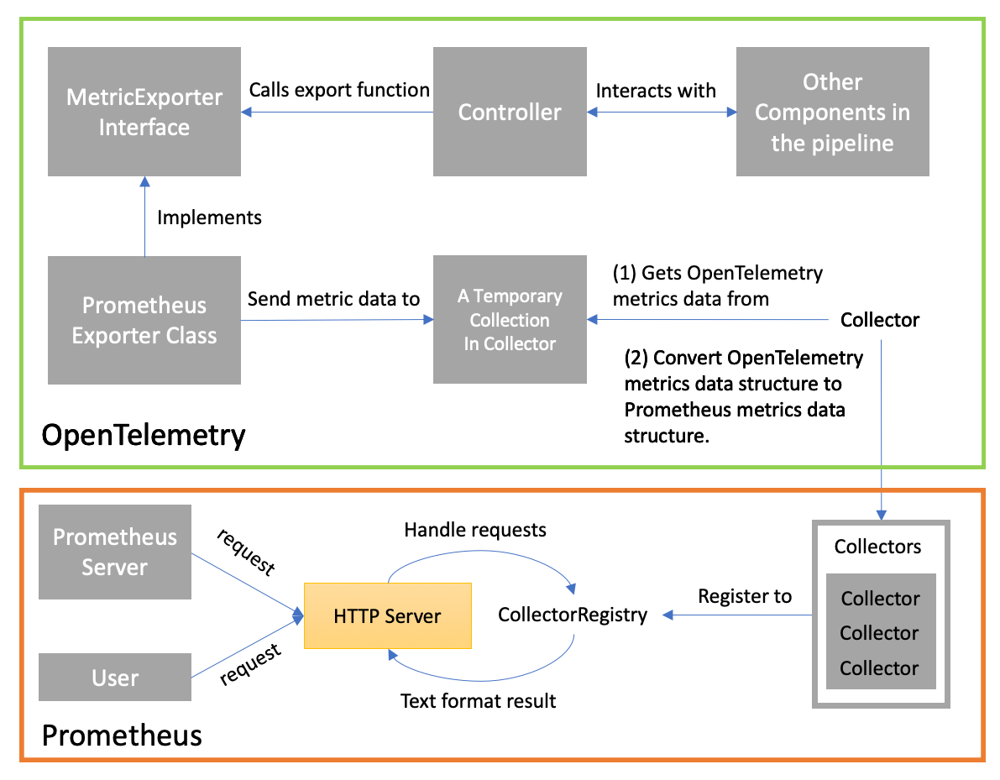
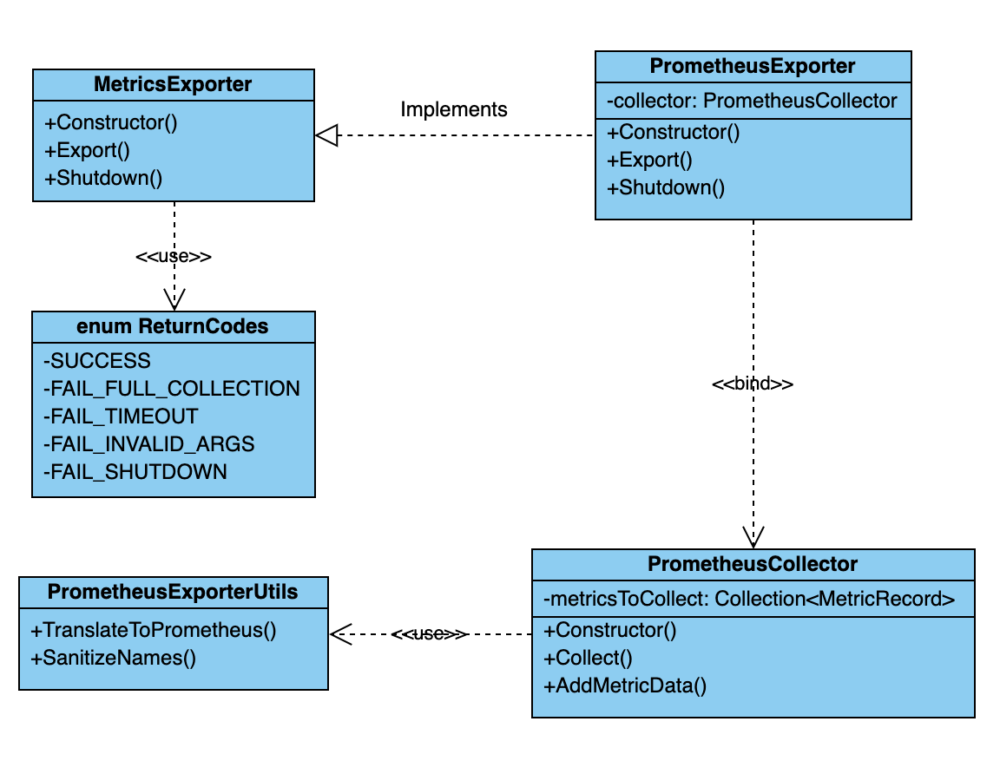
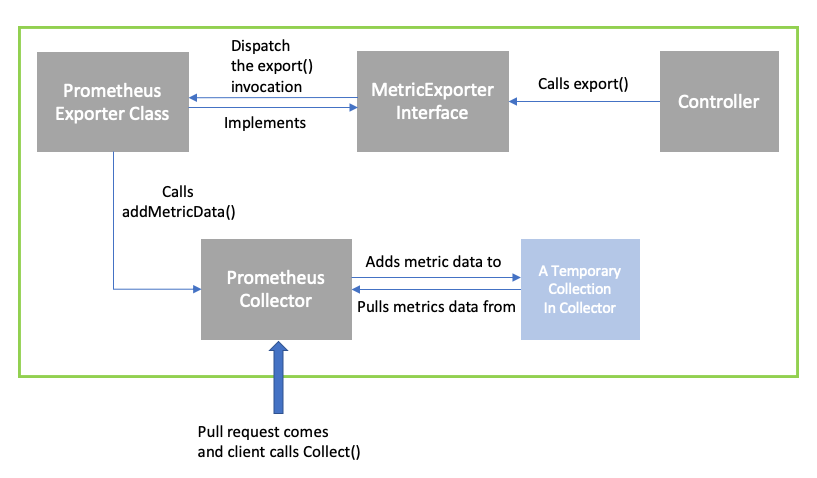

# C++ Prometheus Exporter Design

This document outlines a proposed implementation of the OpenTelemetry Prometheus Exporter in C++. The design conforms to the current versions 
of the [Exporter API Specification]((https://github.com/open-telemetry/opentelemetry-specification/blob/master/specification/trace/sdk.md#span-exporter)) 
and uses design thinking from the existing implementation in other languages including Java, Go, Python, and JavaScript.

## Use Cases
The Prometheus Exporter is used to export the metrics data collected by the OpenTelemetry Collector for Prometheus.

Metrics represent the raw measurements of resource usage or behavior that can be observed and collected throughout your systems. They are 
useful because they provide insight into the behavior and health of your systems, especially when analyzed in aggregate. They represent the 
raw material used by your monitoring system to build a holistic view of your environment, automate responses to changes, and alert the 
end-user (a devops engineer or operator) when required. The metrics are defined in [this](https://www.digitalocean.com/community/tutorials/an-introduction-to-metrics-monitoring-and-alerting) 
article.

Prometheus is a system monitoring and alerting toolkit that collects metrics data via a pull model over HTTP. The Prometheus Server makes 
pull requests to the HTTP server exposed by the exporter and scrapes metrics data on a regular interval.

## Components
This section introduces the components within the Prometheus Exporter as well as their relationships, and the data flow between OpenTelemetry 
and Prometheus from both users’ perspective and inside the OpenTelemetry.


This diagram is re-used from [Metrics API/SDK C++ Design Document](https://github.com/open-telemetry/opentelemetry-cpp/pull/145). It shows the role of an Exporter in the data pipeline. The `export()` 
function in Exporter is called by the Controller after pre-processing.

Since we only focus on the Exporter in this design, the following diagram de-emphasizes the components before the Controller and emphasizes more 
on the components interacting with Prometheus Exporter directly.



### In the OpenTelemetry scope:
- Other OpenTelemetry components collect and handle metrics data and interacts with Meter. Meter gets metrics data from those components.
- The custom Collector class extends the Collector base class from the Prometheus client.
    - It implements the `collect()` method, which manually collects all metrics data from the Meter.
    - Then, it converts the OTel metrics data class to Prometheus metrics data class.

### In the Prometheus Exporter scope:
- The Collector registers itself with the CollectorRegistry, so that the Prometheus Server knows the existence of this collector, and will collect 
data from this collector later.
- The Prometheus Exporter or Prometheus client starts an HTTP Server and exposes the endpoint `/metrics` (by default), and wait for data 
request. This HTTP Server also holds the metrics data collected by registered collectors.

### Why We Need A Temporary Collection:
- The data pipeline is the Controller calls `export()` function and send out the data. It is a natural pipeline for push based exporters, 
because then the data can be pushed directly to the target system in the `export()` function. For Prometheus it's different because Prometheus 
uses a pull based exporter. We need to wait for a pull request from Prometheus server before serving the data, but we don't know when the 
request will come, so we need some place to store and hold the data.
- This mechanism is already implemented in [Python SDK Prometheus Exporter](https://opentelemetry-python.readthedocs.io/en/stable/_modules/opentelemetry/ext/prometheus.html#PrometheusMetricsExporter).

### Flow of Data from Clients’ Perspective:
1. Clients send pull requests to the exposed HTTP endpoints. A client can be an user that sends an HTTP GET request to the endpoint directly, 
or it can also be the scraper inside the Prometheus Server that requests and scrapes the data on a regular basis.
2. The exposed HTTP server is started by the Prometheus Client. It handles requests, scans all collectors registered in the 
CollectorRegistry, and calls the `collect()` function in each collector.
3. A Collector registers itself to the CollectorRegistry, so that it can be discovered when the HTTP server scans the registry, then the data 
can be collected.
4. Collector gets data from a collection of metrics record in it. The entries in the collection are added by the Exporter, which is called by 
the Controller, and is associated with other components in the data pipeline.


## Design Tenets
- **Reliability**
    - The Exporter should be reliable; data exported should always be accounted for. The data will either all be successfully exported to the 
    destination server, or in the case of failure, the data is dropped.
    - **Thread Safety**. Instead of doing a batch export, Prometheus actively listens on an endpoint, waiting for agents/collectors to fetch 
    the metrics data. In this way, we might need to handle reentrancy.
        - In C++ client, it uses `weak_ptr` and `shared_ptr`.
        - OpenCensus is a predecessor of OpenTelemetry. In the Prometheus Exporter for OpenCensus-CPP, it uses `weak_ptr`, `shared_ptr` and 
        `make_shared`, and there is not an explicit lock in the implementation. However, the exporter’s header file indicates that the exporter 
        is thread safe.
- **Scalability**
    - The Exporter must be able to operate on sizeable systems with predictable overhead growth. A key requirement of this is that the library does 
    not consume unbounded memory resources.
- **Security**
    - The data exported to Prometheus should be the same as the data collected from OpenTelemetry, the data cannot be modified during this process.
    
### Out of Scope for this Design
- **Scalability**
    - One way of addressing scalability is by using a dimension-capping algorithm. The dimension-capping algorithm is used to limit the number
     of labels on an export by introducing a maximum to the amount of labels that can be applied to an export. However, the algorithm is implemented in the 
     processor, and is therefore not in our design scope. On the exporter side, we have a configurable `maxExportBatchSize` to limit the size of 
     a single batch to export, which does a similar job.
- **Security**
    - The metrics data should not be accessible to or viewed by everyone without any restrictions. A reasonable way to limit access is by adding authentication and token validation to the pull requests. This is not in our design scope, because our main focus is exporting data from OpenTelemetry to Prometheus. One of our proposed solutions is, if possible, to collaborate to add some new roles and rules for our service.
    - From the [security section of the official Prometheus documentation](https://prometheus.io/docs/operating/security/), we learned that it 
    is presumed that untrusted users have access to the Prometheus HTTP endpoint and logs, and in the future, server-side TLS support will be 
    rolled out to the different Prometheus projects. At the current stage, this is a potential problem, but it is also out of our design scope. 
    In the future, HTTP basic authentication will be added as well.
- **HTTP Server**
    - Since we have some boilerplate and shows the usage, we don’t need to implement the HTTP server by ourselves.


## Classes Design
In Prometheus Exporter, we plan to have five classes. `MetricsExporter` is an interface that determines the basic behaviors for an exporter. `ReturnCodes` is a class 
that enumerates all possible status codes of the `export()` function in the `MetricsExporter`. `PrometheusExporter` is an implementation of `MetricsExporter` interface 
in the context of Prometheus. `PrometheusCollector` class is where the export job is done. When a Prometheus pull request comes, it collects all metric data from the 
exporter, translates the data to Prometheus data structure, and serves the data. In order to make the `PrometheusCollector` class clean, we have another class called 
`PrometheusExporterUtils` that contains all helper methods required by `PrometheusCollector`.

Here we include a UML class diagram inside the exporter to show the dependencies among the classes.



We also include a diagram to illustrate flow of data within the exporter.



### `MetricsExporter` Class (Interface)
This class is an interface that defines all basic behaviors of an exporter. In C++, there is already a similar class for exporting tracing spans, 
but there is no such a class for metrics data. We design this class (interface) according to the [SpanExporter](https://github.com/open-telemetry/opentelemetry-cpp/blob/master/sdk/include/opentelemetry/sdk/trace/exporter.h) 
in the repository. Ideally, this interface can also be used by other metrics exporter, not only for Prometheus.
```C++
/**
 * Base Metrics Exporter Interface
 */
class MetricsExporter {
public:
    /**
     * Exports a batch of Metric Records. The behavior will be decided in the 
     * implementation.
     */
    ReturnCodes export(Collection<Record> records);
    
    /**
     * Shut down the exporter.
     *
     * Timeout an optional timeout, the default timeout of 0 
     * means that no timeout is applied.
     */
    void shutdown(timeout);
}
```

### `PrometheusExporter` Class
This class is an implementation of the `MetricsExporter` interface and exports Prometheus metrics data. Functions in this class should be called 
by the Controller in our data pipeline.

#### Export the Metric Record Data
`export()` function should be implemented to export the metrics data. When this function is called, it adds the input batch of metric `Record`s to 
a data structure called `metricsToCollect` in the `PrometheusCollector` (will be introduced later).
- **Parameters**: A batch of metric `Records` to export
- **Returns**: ReturnCodes, see [ReturnCodes](#returncodes-class) class

#### Shutdown the Exporter
`shutdown()` function should be implemented to shutdown the exporter. The detailed behavior is not determined yet.

#### Proposed Design & Implementation
`export()` function cannot throw exceptions, because it is called by the Controller and we don't know Controller's behavior when there is 
an exception thrown from `export()`. Instead, we will translate all error cases into different `ReturnCodes`, return to function caller and
inform them the export status.
```C++
/*
 * Prometheus metric exporter for OpenTelemetry.
 */
class PrometheusExporter : public MetricsExporter {
    /**
     * Constructor. 
     */
    PrometheusExporter(std::string &address) {
        // 1. Initialize and set a PrometheusCollector
        // 2. Register the exporter to an exposer at the given address
        // 3. Binds to a PrometheusCollector instance
    }

    /*
     * Implement the export function in the interface
     */
    ReturnCodes export(Collection<Record> records) {
        if (!this.isShutdown) {
            // 1. Add the input records to the data stucture inside the collector.
            // 2. Return ExportResult
        }
    
        return FAILURE;
    }

    /*
     * Implement the shutdown function in the interface
     * Shut the exporter down. 
     */
    void shutdown() {
        // Behavior not determined yet.
        // Do something like unregister the collector, some gc...
        this.isShutdown = true;
    }
    
    /*
     * Get the Prometheus collector.
     */
    PrometheusCollector *getCollector() {
    
    }

    /**
     * Get shutdown status
     */
    boolean isShutdown() {
        return this.isShutdown;
    }

private:
    /**
     * exporter shutdown status
     */
    boolean isShutdown;

    /*
     * PrometheusCollector instance
     */
    PrometheusCollector *collector;

    /**
     * Exposer instance
     */
    Exposer *exposer;
}
```

### `PrometheusCollector` Class
The `PrometheusCollector` class refers to a Collector in the data flow diagram above. It should be registered to the registry provided by the 
Prometheus client. When a pull request is received, the HTTP server handler will see this `PrometheusCollector` and collects all data stored 
in the collection inside this Collector by calling `collect()` function.

#### Collect all metrics data
`collect()` method must be supported to collect all metrics data from the internal collection `metricsToCollect`.
- **Parameters**: This function does not require any input.
- **Return**: A collection of metrics data converted to the data structure that is compatible with the [Prometheus data format](https://github.com/prometheus/docs/blob/master/content/docs/instrumenting/exposition_formats.md#text-format-details). 
The data structure (class) should come from the Prometheus client. Here we have listed some transformations seen in other language SDK implementations.
    - In Java, `MetricData` => `MetricFamilySamples`
    - In Node.js, `MetricRecord` => `Metric`
    - In Python, `MetricRecord` => `MetricFamily`
    - In Go, `export.Record` => `prometheus.Metric`
    - In C++, we plan to convert `Record` defined in Metrics API/SDK design to `MetricFamily` from the C++ client.

#### Add new metric record to collection
`addMetricData()` is used to add a new metric record into the metricsToCollect collection. This function should be called by the `export()` 
function in the `PrometheusExporter`.
- **Parameters**: The metric records to add.
- **Return**: This function does not return anything.

#### Proposed Design & Implementation
The `PrometheusCollector` class has a constructor to initialize a collector and the `metricsToCollect` collection that will be used temporarily 
store the metrics data. This class should also extend the base collector class from the Prometheus client, so that it can also register to the 
Prometheus registry.

This concept is implemented in the Java, Python and Go SDKs. Hence we assume that this can also be reused for C++.

Here is the proposed C++ version Prometheus collector.
- `Collectable` is the base collector class that can be registered to registry in C++ client;
- `MetricFamily` is the class to hold metrics data that conforms to Prometheus data format in C++ client.

`Collect()` function cannot throw any exceptions, because it's called by Prometheus client. We don't know the behavior of Prometheus client
if there is an exception from `Collect()` method. If there are errors when collecting some data entry, we will just ignore that entry.
```C++
/**
 * Prometheus Collector Class
 */
class PrometheusCollector : public Collectable {
public:
    /**
     * Default Constructor
     */
    PrometheusCollector(int maxCollectionSize = 2048) {
        // Initialize the collection for metrics to export
        // in this class with default capacity
    }
 
    /**
     * Collects all metrics data from metricsToCollect collection.
     */
    Collection<MetricFamily> Collect() {
        // 1. Initialize a collection to return.
        // 2. Iterate through all entries in the collection.
        //       For each Record in the collection:
        //            Call helper function to convert the data type.
        //            Add the converted data to return collection.
        // 3. Returns collection of converted data.
    }
    
    /* 
     * Function called by PrometheusExporter.
     *
     * This function may also need a lock.
     */
    void addMetricData(Collection<Record> records) {
        // 1. The Controller calls export() function to send 
        //    processed metrics data,
        // 2. export() function then calls this function to add
        //    the data to the metricsToCollect collection.
    }
    
    /*
     * Get the current collection in the collector.
     */ 
    Collection<Record> getCollection() {
    
    }
    /**
     * Gets the maximum size of the collection.
     */
    int getMaxCollectionSize() {

    }
 
private:
    /*
     * Collection of metrics data from the export() function,
     * and to be export to user when they send a pull request.
     */
    Collection<Record> *metricsToCollect;

    /**
     * Maximum size of the metricsToCollect collection.
     */
    int maxCollectionSize;

    /*
     * Lock when operating the collection
     */
    mutex lock;
};
```

#### Concurrent Operations on `metricsToCollect`
Both `collect()` function and `addMetricData()` function will modify the metricsToCollect. In this section we discuss our design to handle the 
concurrency problem. One simple case is Collector adds new metric records to the collection at the same time when users are pulling data from 
the collection.

**Add new metric record to collection**

`addMetricData()` takes a batch of metric records as input and adds the records to the collection. This operation is easy and quick, so the 
lock will not be held for a long time. Here is a pseudo-code snippet
```C++
void addMetricData(Collection<Record> records) {
    // require a lock;
    lock.acquire();
    
    // ======= Enter the critical region ======
    
    // operate the data collection (ignore the capacity problem here)
    metricsToCollect.batchAdd(records);
    
    // release the lock
    lock.release();
    
    // ======= Leave the critical region ======
}
```
Here we ignore the case when the `metricsToCollect` is full, and we will discuss this problem in detail later.

**Collect all metrics data**

`collect()` method collects all metrics data from the `metricsToCollect` and clears it. This operation is more complicated since it handles a 
batch of data, and it also involves extra function calls to transfer the data type.

In order to avoid holding the lock for a long time, we proposed to combine the lock and a deep copy in our implementation. We plan to copy the 
current collection, and process the copy. What user pulls is actually a snapshot of the collection.

The function to translate OpenTelemetry metrics data to Prometheus metrics data has nothing to do with the `metricsToCollect` collection itself, 
so translation should not be considered required.
```C++
Colletion<MetricFamily> collect() {
    // a copy of data
    Collection<Record> copiedCollection;
    
    // require a lock;
    lock.acquire();
    
    // ======= Enter the critical region ======
    
    // copy the collection
    copy(metricsToCollect, copiedCollection);
    
    // clear the current collection
    metricsToCollect.clear();
    
    // release the lock
    lock.release();
    
    // ======= Leave the critical region ======
    
    // process the copied data 
    return PrometheusExporterUtils.translateToPrometheus(copiedCollection);
}
```

**Deadlock Consideration**

Some necessary conditions for a deadlock to happen are hold and wait and circular wait, threads need to hold a lock and wait for another lock. 
We only have one lock to manage the concurrent visit of `metricsToCollect`, so there will not be a deadlock in our current design.

#### Boundary Problem on `metricsToCollect`
**Notes:** This mechanism of having an intermediate collection to hold the data in order to change the push-based model to a pull-based model is also 
accepted by Python SDK Prometheus Exporter implementation, but they do not handle the upper bound problem. We have filed an [issue](https://github.com/open-telemetry/opentelemetry-python/issues/874) 
to the Python community and waiting for their explanation.

Controller is producing data records to the collection, and users are consuming data records from the collection. What if the production rate 
is larger than the consumption rate, and the collection is full? We cannot allow the memory used by this collection grows unlimitedly. We 
proposed two solutions to it.

**Solution One: Time Upper Bound**

The first solution is to use a time upper bound and set a timeout. Use a timer to keep track of the time elapsed after last pull. After the 
pre-defined time threshold, do a fake pull to flush data.
- When the user pull data successfully, set the timer to zero can keep track of the time again.
- Some questions:
    - Where does the fake flush dumps the data to? Does it discard this data?
    - On the Prometheus side, what if it finds some metrics data missing (due to the fake flush)?
    - What are the standards to choose a reasonable timeout?
    - We still need to use some kind of a data structure to hold the data, so the size of the collection is still limited. What if the collection is 
    full before a fake flush?

Considering these uncertainties, we think this plan does not actually solve the boundary problem.

**Solution Two: Memory Upper Bound**

The second solution is to limit the size of the collection. When the collection is full, we then further handle the situation.

Some problems to consider:
1. What data structure to use?
    - Since we are allowed to use STL in exporter implementation, we plan to use `std::vector` for the following reasons: 
        - The size of `std::vector` is configurable. 
        - We need to do a deep copy every time when the `collect()` function is called, and there is an efficient built-in function `memcopy()` to do that on vector.
2. What is a standard collection size?
    - A reasonable maximum collection size can be determined by looking at the specification. As a reference, we can look at [configurable parameters](https://github.com/open-telemetry/opentelemetry-specification/blob/master/specification/trace/sdk.md#batching-processor) 
    for traces. We can see that the default values for `maxQueueSize` is `2048`, while `maxExportBatchSize` has a default value of `512`. `maxQueueSize` 
    describes the value at which, once exceeded, spans will be dropped; `maxExportBatchSize` is fairly self-explanatory, with the added detail that it 
    must be less than or equal to `maxQueueSize`. From this, we can determine a reasonable collection size, and we can also determine that the collection 
    size should be configurable.
3. How can we handle the case when collection is full? Do we discard the new data entry? Do we make the collection like a LRU cache and discard the first entry in the collection?
    - When there is not enough space in the collection to receive, the C++ Prometheus exporter will follow the implementation of what most tracer exporters would do, and that is to simply discard the data. **No replacement algorithm is needed**.

Considering the benefits and downsides of both solutions, we recommend **Memory Upper Bound** as a solution to this problem.

There are some other issues related to the Metrics API. The Controller calls the `export()` function and get an export status from the 
return value. Currently we only have one status for failure called `FAILURE`, but it’s vague for the function caller wrt the upper bound 
problem. A possible solution could be to add a new status like `FAILURE_FULL` to inform the caller about a more detailed cause of failure. However a caller can have different error handlers for different reasons of failure. The following `ReturnCodes` class is what we proposed to handle this situation. We used this concept from the [`CanonicalCode`](https://github.com/open-telemetry/opentelemetry-cpp/blob/master/api/include/opentelemetry/trace/canonical_code.h) class in tracing module.


### `ReturnCodes` Class
This class provides an expansion on the possible return codes for the `export()` function. Currently, only `SUCCESS` and `FAILURE` are available 
as return codes; so we plan to expand the `FAILURE` codes and specifying what type of `FAILURE` it is. This class is influenced by [this](https://github.com/open-telemetry/opentelemetry-cpp/blob/master/api/include/opentelemetry/trace/canonical_code.h) 
implementation for spans; similar to this implementation, `ReturnCodes` will be implemented as an enum class.

#### Success
On a successful export, the return code is `SUCCESS`.

#### Failures
On a failed export, multiple types of failure codes will be available. 
- `FAILURE_FULL_COLLECTION` is returned when the collection does not have enough space to receive the export batch. 
- `FAILURE_TIMEOUT` is returned when the export has taken too long to execute and has timed out. 
- `FAILURE_INVALID_ARGUMENT` is returned when `export()` is passed an invalid argument (e.g., not a proper collection of records).
- `FAILURE_ALREADY_SHUTDOWN` is returned when the exporter is shutdown.

#### Proposed Design & Implementation
```C++
/**
 * Return Codes Class
 */
 enum class ReturnCodes : uint8_t
 {
    /**
     * Batch exported successfully.
     */
    SUCCESS = 0;
    
    /**
     * The collection does not have enough space to receive the export batch.
     */
    FAILURE_FULL_COLLECTION = 1;
    
    /**
     * The export has timed out.
     */
    FAILURE_TIMEOUT = 2;
    
    /**
     * The export() function was passed an invalid argument.
     */
    FAILURE_INVALID_ARGUMENT = 3;
    
    /**
     * The exporter is already shutdown.
     */
    FAILURE_ALREADY_SHUTDOWN = 4;
 };
```


### `PrometheusExporterUtils` Class
This class contains all helper methods that will be called by the `collect()`, in order to separate the responsibilities and make the 
`PrometheusCollector` class clean. This class mainly supports two helpers, `translateToPrometheus()` that translates a collection of 
OpenTelemetry metrics data to a collection of Prometheus metrics data, and `sanitizeNames()` that replaces all illegal characters in Prometheus 
with `_` because of different naming rules between OpenTelemetry and Prometheus.

#### Translate data structure
`translateToPrometheus(collection)` translates OpenTelemetry metrics data to a Prometheus acceptable form.
- **Parameters**: A collection of OpenTelemetry metrics data collected from meters.
- **Return**: A collection of metrics data converted to the data structure that is accepted by Prometheus.

### Sanitize the name strings
`sanitizeNames(otel_name)` replace all characters other than `_` and alphanumerical characters to `_`.
- **Parameters**: A label name or metric name in OpenTelemetry that may contain `.` or `-`, which are invalid characters in Prometheus naming rule.
- **Return**: A string that has all invalid characters in Prometheus replaced to `_`.

### Proposed Design & Implementation
`sanitizeNames()` is an internal helper function called by `translateToPrometheus()`, and there may be other helper functions as we
develop. When having some errors like bad input and illegal name result, `sanitizeNames()` can throw an exception, and `translateToPrometheus()`
catchs and handles this exception, ignores this data entry and process next one.
```C++
/**
 * Prometheus Collector Class
 */
class PrometheusExporterUtils
{
public:        
    /**
     * Helper function to convert OpenTelemetry metrics data collection
     * to Prometheus metrics data collection
     */
    static Collection<MetricFamily> translateToPrometheus(
            Collection<Record> oTelMetrics) 
    {
        // There may also be additional helper functions revoked in
        // this function to translate label, metric type, and data
        // structures, and so on.
    }
    
    /**
     * Sanitize the given metric name or label according to Prometheus rule. 
     *
     * This function is needed because names in OpenTelemtry can contain 
     * alphanumeric characters, '_', '.', and '-', whereas in Prometheus the
     * name should only contain alphanumeric characters and '_'.
     */
    static string sanitizeNames(string key)
    {
        // Replace all characters other than [A-Za-z0-9_] with '_'.
        // ...
    }
};
```

## Exposed HTTP Server
In Prometheus Exporter, the HTTP server is an important component, because the Prometheus Exporter exposes data on this HTTP endpoint that is 
scraped by a Prometheus server. On reviewing the implementation in other languages, we find two different ways.
1. Java and Python SDK did not include the HTTP server in the Prometheus exporter implementation. They left the job of starting a HTTP server to client.
2. Node.js and Go support the HTTP server in SDK.

We then considered the pros and cons of supporting exposing an HTTP endpoint in our C++ Prometheus Exporter:

**Pros:**
1. It may be user friendly, because user do not need to setup the HTTP server, and can export metrics to Prometheus out of box. User can use 
the exporter even if they don’t know there should be an HTTP server there.
2. It conforms to the Prometheus Exporter structure. The HTTP server should be a part of the Prometheus Exporter. What Java and python did is 
splitting them into two pieces.

**Cons:**
1. Extra work to manage the HTTP server, to create it, and to close it.
2. Extra work to handle multiple concurrent pull requests.
3. The implementation may depend on the C++ Prometheus client. The C++ client already have a mechanism to start a server (`Exposer`), so it 
seems to be redundant if we add a server in exporter.

### Use Cases of Exposer in C++ Client
We refer to the Prometheus Exporter implementation in [OpenCensus project](https://github.com/census-instrumentation/opencensus-cpp/tree/master/opencensus/exporters/stats/prometheus). 
The first recommended way is using the Exposer provided by the Prometheus client library to work as a HTTP server.
```C++
auto exporter =
      std::make_shared<opencensus::exporters::stats::PrometheusExporter>();

// Expose a Prometheus endpoint.
prometheus::Exposer exposer("127.0.0.1:8080");
exposer.RegisterCollectable(exporter);
```

In our OpenTelemetry version, the equivalent could be
```C++
// name the address+port the server will be running on
std::string address = "127.0.0.1:8080";

// create an exporter and register the collector in it to exposer
// Inside the PrometheusExporter constructor:
// 1. Initialize a PrometheusCollector
// 2. Initialize an exposer
// 3. Register the collector to exposer
auto exporter = PrometheusExporter(address);
```

Consider the existing, working OpenCensus project, and the drawbacks of supporting an HTTP server in our exporter manually, we recommend **NOT** 
to integrate a server inside the exporter, at least for our first version of implementation. We will also leave to job of exposing an HTTP endpoint 
to clients. If we have more time for the project after implementing the current design, we will come back and consider integrating an HTTP server.


## Test Strategy / Plan
In this project, we will follow a test driven development methodology, by adding functional unit tests before implementing the final version of the code. We plan to design exhaustive test cases for normal and abnormal inputs, and tests for edge cases. Since the Prometheus Exporter will fetch its metrics data from 
Meter, which is defined and implemented in Metric API/SDK, we also plan to have an integration test with Metric API together.

In terms of test framework, we will be using the [Google Test](https://github.com/google/googletest) framework. We have done a Google Test Demo 
internally to test the compatibility.
