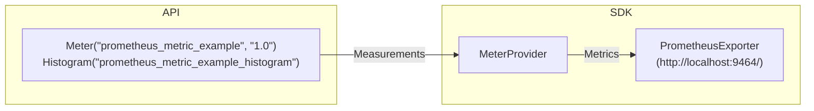

# Getting Started with Prometheus and Grafana

- [Export metrics from the application](#export-metrics-from-the-application)
  - [Check results in the browser](#check-results-in-the-browser)
- [Collect metrics using Prometheus](#collect-metrics-using-prometheus)
  - [Configuration](#configuration)
  - [Start Prometheus](#start-prometheus)
  - [View results in Prometheus](#view-results-in-prometheus)
- [Explore metrics using Grafana](#explore-metrics-using-grafana)
- [Learn more](#learn-more)

## Export metrics from the application

Run the application with:

```sh
bazel run //examples/prometheus:prometheus_example
```

OpenTelemetry `PrometheusExporter` will export
data via the endpoint defined by
`metrics_exporter::PrometheusExporterOptions::url`,
which is `http://localhost:9464/` by default.



Also, for our learning purpose, we use a while-loop to keep recoring random
values until the program stops.

```cpp
while (true)
{
    double val = (rand() % 700) + 1.1;
    std::map<std::string, std::string> labels = get_random_attr();
    auto labelkv = opentelemetry::common::KeyValueIterableView<decltype(labels)>{labels};
    histogram_counter->Record(val, labelkv, context);
    std::this_thread::sleep_for(std::chrono::milliseconds(50));
}
```

### Check results in the browser

Start the application and keep it running. Now we should be able to see the
metrics at [http://localhost:9464/metrics](http://localhost:9464/metrics) from a
web browser:


Now, we understand how we can configure `PrometheusExporter` to export metrics.
Next, we are going to learn about how to use Prometheus to collect the metrics.

## Collect metrics using Prometheus

Follow the [first steps](https://prometheus.io/docs/introduction/first_steps/)
to download the [latest release](https://prometheus.io/download/) of Prometheus.
It is also possible to use `prom/prometheus` docker image.

### Configuration

After downloading, extract it to a local location that's easy to
access. We will find the default Prometheus configuration YAML file in the
folder, named `prometheus.yml`.

```yaml
global:
  scrape_interval: 5s
  scrape_timeout: 2s
  evaluation_interval: 5s
scrape_configs:
  - job_name: otel
    static_configs:
      - targets: ['localhost:9464']
```

### Start Prometheus

Follow the instructions from
[starting-prometheus](https://prometheus.io/docs/introduction/first_steps/#starting-prometheus)
to start the Prometheus server and verify it has been started successfully.

Please note that we will need pass in `prometheus.yml` file as the argument
or mount as volume:

```console
./prometheus --config.file=prometheus.yml
# OR:
docker run -p 9090:9090 -v $(pwd):/etc/prometheus --network="host" prom/prometheus
```

### View results in Prometheus

To use the graphical interface for viewing our metrics with Prometheus, navigate
to [http://localhost:9090/graph](http://localhost:9090/graph),
and type `prometheus_metric_example_histogram_bucket` in the expression bar of
the UI; finally, click the execute button.

We should be able to see the following chart from the browser:


From the legend, we can see that the `instance` name and the `job` name are the
values we have set in `prometheus.yml`.

Congratulations!

Now we know how to configure Prometheus server and deploy OpenTelemetry
`PrometheusExporter` to export our metrics. Next, we are going to explore a tool
called Grafana, which has powerful visualizations for the metrics.

## Explore metrics using Grafana

[Install Grafana](https://grafana.com/docs/grafana/latest/installation/).

Start the standalone Grafana server (`grafana-server.exe` or
`./bin/grafana-server`, depending on the operating system). Then, use the
browser to navigate to [http://localhost:3000/](http://localhost:3000/).
It is also possible to run `grafana/grafana` container:

```sh
docker run -d -p 3000:3000 --network="host" grafana/grafana
```

Follow the instructions in the Grafana getting started
[doc](https://grafana.com/docs/grafana/latest/getting-started/getting-started/#step-2-log-in)
to log in.

After successfully logging in, click on the Configuration icon
on the panel at the left hand side, and click on Prometheus.
Type in the default endpoint of Prometheus as suggested by the UI
as the value for the URI.

```console
http://localhost:9090
```

Then, click on the Explore icon on the left panel of
the website - we should be able to write some queries to explore our metrics
now!

Feel free to find some handy PromQL
[here](https://promlabs.com/promql-cheat-sheet/).


## Learn more

- [What is Prometheus?](https://prometheus.io/docs/introduction/overview/)
- [Grafana support for
  Prometheus](https://prometheus.io/docs/visualization/grafana/#creating-a-prometheus-graph)
