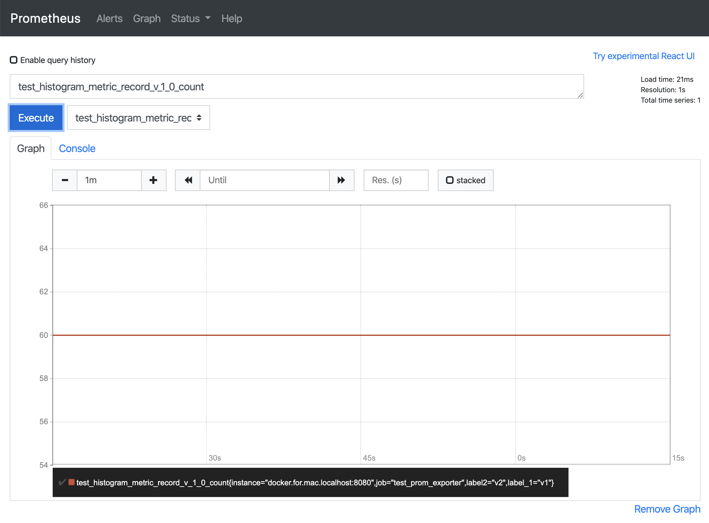
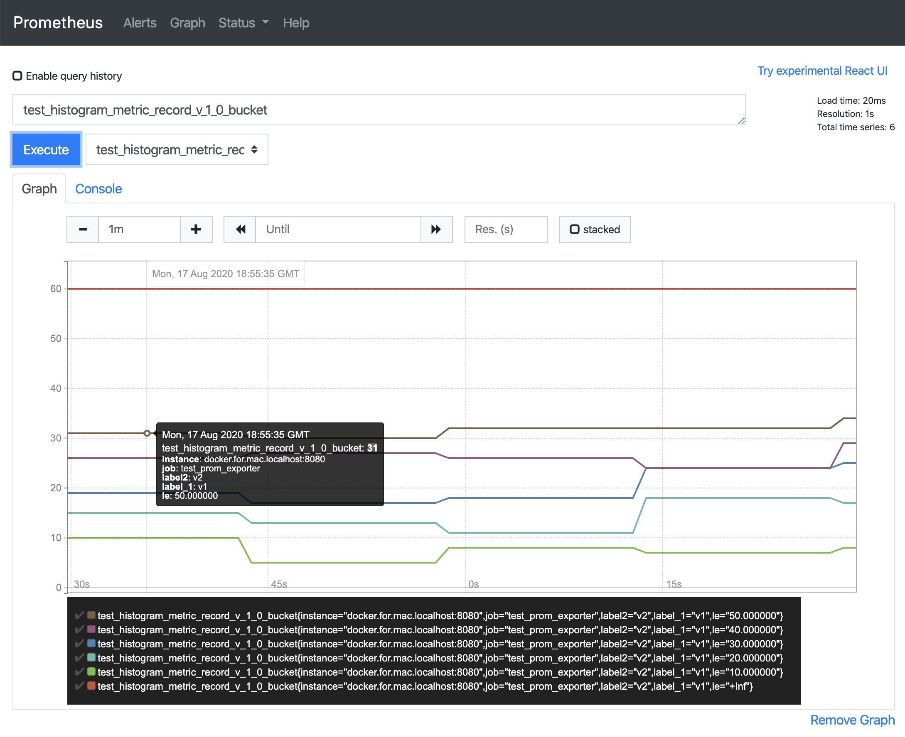

# Prometheus Exporter Example

In this example, the application in `main.cc` initializes the Prometheus exporter and exports 6 different OTel Aggregator to Prometheus. 
Here are more detailed explanations of it.

## Start Prometheus Instance
Start a Prometheus instance with Docker:
```shell script
docker run prom/prometheus
```
Add Prometheus Exporter job configuration to `~/docker/prometheus/prometheus.yml`
```yaml
scrape_configs:
  # ...
  # other jobs
  # ...
  - job_name: 'test_prom_exporter'
    static_configs:
      - targets: ['docker.for.mac.localhost:8080']
```
Restart Prometheus instance and specify configuration file
```shell script
docker run -d --expose 8080 \
  -p 9090:9090 \
  -v ~/docker/prometheus/prometheus.yml:/etc/prometheus/prometheus.yml  \
  prom/prometheus
```

## Run Example Program
Run with Bazel:
```shell script
bazel build //examples/prometheus_exporter:prometheus_exporter_example
bazel-bin/examples/prometheus_exporter/prometheus_exporter_example
```
Specify the Aggregator Kind you want to run the demo
```
Prometheus Exporter example program running on localhost:8080...
Choose an aggregator example: {counter, gauge, mmsc, histogram, exact, sketch}
{type an answer here}
```
For example, choose Histogram
```
Prometheus Exporter example program running on localhost:8080...
Choose an aggregator example: {counter, gauge, mmsc, histogram, exact, sketch}
histogram
Running histogram example program...
```
The example program generates 4 metrics every second, and exports every 15 seconds.

Wait for a while, and visit `localhost:9090`. Choose the name of metrics to view the graphs.

Histogram Count: Each batch of metric data contains 60 metrics



Histogram Sum:


Histogram Buckets:



The process is similar for other OTel Aggregator.