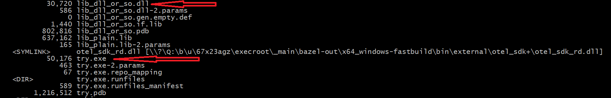
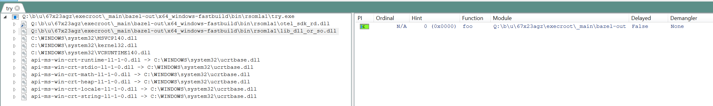

https://github.com/open-telemetry/opentelemetry-cpp/issues/3176

# Download bazelisk, and do this from this folder

bazel test try

```
F:\p\m\opentelemetry-cpp\x\rsomla1>bazel test try
INFO: Invocation ID: a572e4c9-8838-433a-ac10-ba19b92e41a4
WARNING: Streamed test output requested. All tests will be run locally, without sharding, one at a time
INFO: Analyzed target //rsomla1:try (1 packages loaded, 4 targets configured).
INFO: From Linking rsomla1/try.exe:
lld-link: warning: bazel-out/x64_windows-fastbuild/bin/rsomla1/_objs/try/try.obj: locally defined symbol imported: foo (defined in bazel-out/x64_windows-fastbuild/bin/rsomla1/_objs/try/lib.obj) [LNK4217]
foo DONE!
{
  name          : foo
  trace_id      : 9a881c06d445a258a4e51401909f7422
  span_id       : 40bd1aac2e435d33
  tracestate    :
  parent_span_id: 987e069eea5c9aa2
  start         : 1733110404114213500
  duration      : 58700
  description   :
  span kind     : Internal
  status        : Unset
  attributes    :
  events        :
  links         :
  resources     :
        telemetry.sdk.language: cpp
        telemetry.sdk.name: opentelemetry
        telemetry.sdk.version: 1.18.0
        service.name: unknown_service
  instr-lib     : lib-0.0.1
}
Done!
{
  name          : main
  trace_id      : 9a881c06d445a258a4e51401909f7422
  span_id       : 987e069eea5c9aa2
  tracestate    :
  parent_span_id: 0000000000000000
  start         : 1733110404114169800
  duration      : 240400
  description   :
  span kind     : Internal
  status        : Unset
  attributes    :
  events        :
  links         :
  resources     :
        telemetry.sdk.language: cpp
        telemetry.sdk.name: opentelemetry
        telemetry.sdk.version: 1.18.0
        service.name: unknown_service
  instr-lib     : try-0.0.1
}
INFO: Found 1 test target...
Target //rsomla1:try up-to-date:
  Q:/b/u/67x23agz/execroot/_main/bazel-out/x64_windows-fastbuild/bin/rsomla1/try.exe
INFO: Elapsed time: 11.789s, Critical Path: 9.35s
INFO: 5 processes: 1 internal, 4 local.
INFO: Build completed successfully, 5 total actions
```

# Added proper lib.dll (lib_dll_or_so.dll)

- Bin folder had this, note the `lib_or_so.dll` and `try.exe`



- Here is what `lib_dll_or_so.dll` ended up importing from `otel_sdk.dll`


- Here is what `try.exe` refernece from `lib_dll_or_so.dll` - e.g. `foo`



- And what `try.exe` references from `otel_sdk.dll`


